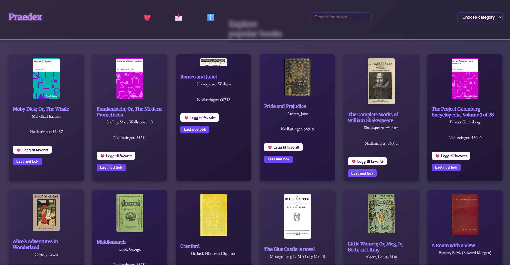

<p align="center">
  
</p>

# 📚 Pradex – En visuell utforskning av Project Gutenberg

**Pradex** er et frontend-prosjekt som presenterer bøker fra [Project Gutenberg](https://www.gutenberg.org/) på en visuell, katalog-lignende måte.  
Inspirert av ideen om et "bokkartotek" kombinerer appen klassisk litteratur med moderne webteknologi.

---

## 📘 Hva er dette prosjektet?

Dette prosjektet ble utviklet som en del av en tidligere skoleoppgave.  
Målet var å lage en webapplikasjon som kunne presentere innhold fra Project Gutenberg på en måte som er lett å bruke, utforske og lære av.

---

## 🛠️ Teknologier brukt

- **React**
- **Vite**
- **JavaScript / JSX**
- **CSS** – egen stil
- **Fetch API** – for å hente bøker
- **Project Gutenberg API** (data)
- **LocalStorage** – for favoritter

---

## 🗂️ Prosjektstruktur

```
gutenbergdex/
├── public/
│   └── images/         # Logo og skjermbilder
├── src/
│   ├── components/     # Reusable UI-komponenter
│   ├── pages/          # Hovedsider
│   ├── styles/         # CSS-filer
│   └── App.jsx         # Root-komponent
├── index.html
├── package.json
└── vite.config.js
```

---

## 📸 Eksempel på appen

<p align="center">
  
</p>

---

## ✨ Funksjoner

- 🔍 Bla gjennom bøker via API
- 📖 Se detaljer og beskrivelse
- ❤️ Lagre favoritter (lokalt)
- 🎨 Egne kort for hver bok
- 🔗 Lenker til full lesing via Gutenberg

---

## ✅ Læringsmål og resultater

Dette prosjektet hjalp meg med å:
- Mestre komponentbasert utvikling
- Hente og vise data fra tredjeparts-API
- Organisere kode og strukturere komponenter
- Bruke LocalStorage til favorittsystem
- Forbedre styling og brukeropplevelse

---

## ✍️ Signatur

```
//  One bug to find them,
//  One fix to bring them all,
//  And in the darkness bind them.
```

---

## 📬 Kontakt

Dette er et avsluttet prosjekt, men jeg er alltid åpen for feedback eller forbedringer. Ta gjerne kontakt!

---